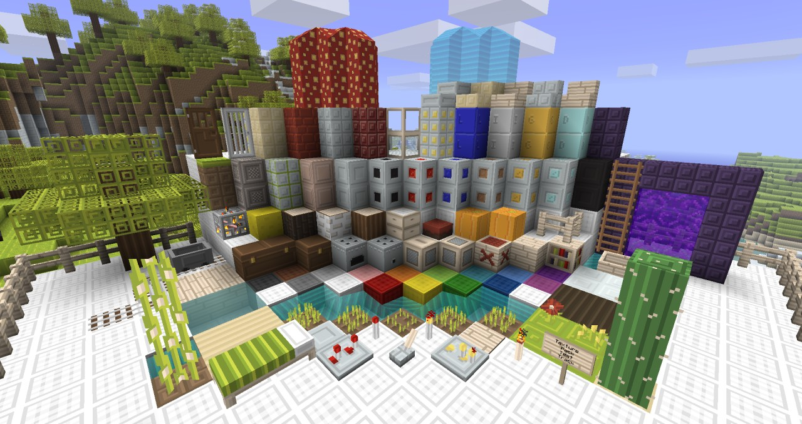

# Leostereo's Textures REVAMPED (Updated)

This project aims to "bring back" this 1.7.2 Beta/1.8 Beta (Sep 11th, 2011) texture pack to newer Minecraft versions. Its original creator, the masterful talented "Leostereo" has not updated it since (understandably so). You can still find it at [PlanetMinecraft](https://www.planetminecraft.com/texture-pack/leostereos-textures-revamped/).

This "repository" is distributed as-is, I'm not willing to make all new blocks, mobs, etc. I'm not even aiming to bring back all textures already present either, some will be left behind such as mobs and few blocks/entities that changed considerably.

# ⬇️ Download (Current Version: 26.2 - 2026) - Java Only!
Click [**here**](https://github.com/parklez/leostereo/releases/latest/download/leostereo-updated.zip) to download the latest version I've worked on from the releases page.

# Conversion process
Here's the overall process I did step by step:

- Removed unused assets from terrain.png (The author likely used unused spots to leave some ideas behind)
- Used [unstitcher](https://github.com/flying-sheep/unstitcher/tree/master)
- Used [TextureEnder](https://github.com/Mojang/TextureEnder/tree/master)
- Used [ResourcePackConverter](https://github.com/agentdid127/ResourcePackConverter) to convert it to `1.21.4`

# Changes made by me
In my own pursue to continue using this texture pack in the following years, I've attempted to update some basic textures AND add a few on my own. I might not remember every single thing I've added or edited these past 15 years...

 - Made colormaps transparent for [grass](./assets/minecraft/textures/colormap/grass.png) and [foliage](./assets/minecraft/textures/colormap/foliage.png) - This keeps an uniform look that I'm used to. The side effect is that some tree's leaves and grass will look grey. This can be fixed by adding color to them manually.
 - Removed mob textures. This requires manual re-work and I'm particularly not a strong fan of how most of them look.
 - Edited [title](./assets/minecraft/textures/gui/title/minecraft.png), [inventory](./assets/minecraft/textures/gui/container/inventory.png) to fit properly.
 - Add colored glass, trip-wire, nether wart, nether brick, brewing stand, cauldron, emerald ore, end stone, etc. I'm not a great artist but I did what I could!

Thank you Leostereo, this texture pack is still fascinating to me almost 2 decades later... I made this repository so your work can bring joy to a new generation...